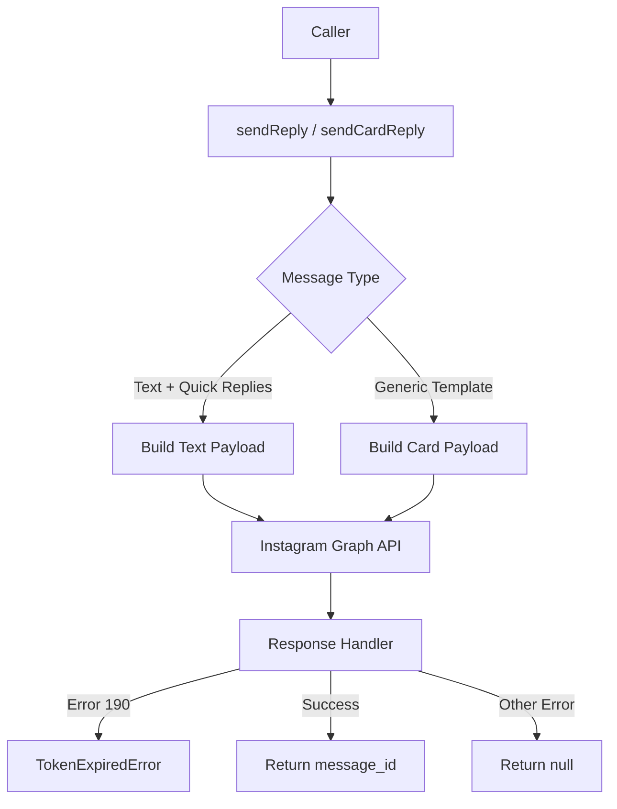
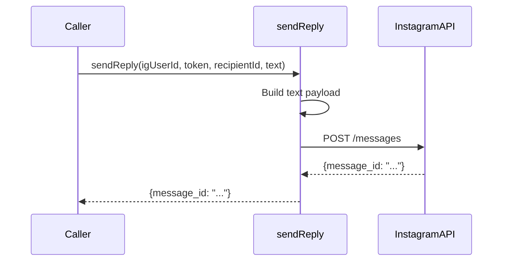
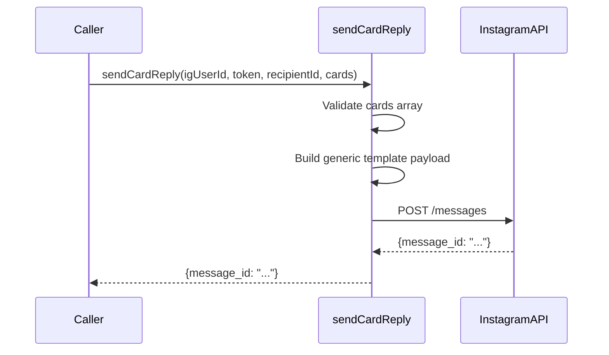

# Design Document: Instagram Card Messages

## Overview

This feature extends the existing `sendReply` function in `supabase/functions/_shared/meta/api.ts` to support Instagram generic template cards (carousels). The current implementation only handles text messages and quick replies. We will add support for sending rich media cards with images, titles, subtitles, and buttons, enabling more engaging user interactions through Instagram DMs.

The design maintains backward compatibility with existing text message functionality while introducing new interfaces and payload structures to handle the Instagram Graph API's generic template format.

## Architecture



## Sequence Diagrams

### Text Message Flow (Existing)



### Card Message Flow (New)



## Components and Interfaces

### Component 1: Message Type Definitions

**Purpose**: Define TypeScript interfaces for card elements, buttons, and message payloads

**Interface**:
```typescript
interface CardButton {
  type: 'web_url' | 'postback'
  title: string
  url?: string      // Required if type is 'web_url'
  payload?: string  // Required if type is 'postback'
}

interface CardElement {
  title: string
  subtitle?: string
  image_url?: string
  buttons?: CardButton[]
}

interface GenericTemplatePayload {
  template_type: 'generic'
  elements: CardElement[]
}

interface AttachmentMessage {
  attachment: {
    type: 'template'
    payload: GenericTemplatePayload
  }
}

interface SendCardReplyBody {
  recipient: { id: string }
  message: AttachmentMessage
  messaging_type: string
}
```

**Responsibilities**:
- Type safety for card message construction
- Ensure compliance with Instagram API requirements
- Enable autocomplete and validation during development

### Component 2: sendCardReply Function

**Purpose**: Send generic template cards to Instagram users

**Interface**:
```typescript
async function sendCardReply(
  igUserId: string,
  accessToken: string,
  recipientId: string,
  cards: CardElement[]
): Promise<{ message_id: string } | null>
```

**Responsibilities**:
- Validate card elements (max 10 cards per message)
- Validate buttons (max 3 per card)
- Construct Instagram-compliant generic template payload
- Make API request to Instagram Graph API
- Handle errors (token expiration, API failures)
- Return message ID or null

### Component 3: sendReply Function (Modified)

**Purpose**: Maintain existing text message functionality

**Interface**: (No changes to signature)
```typescript
async function sendReply(
  igUserId: string,
  accessToken: string,
  recipientId: string,
  messageText: string,
  quickReplies?: Array<{ title: string; payload: string }>
): Promise<{ message_id: string } | null>
```

**Responsibilities**:
- Unchanged: continue supporting text messages
- Unchanged: continue supporting quick replies
- Maintain backward compatibility

## Data Models

### Model 1: CardButton

```typescript
interface CardButton {
  type: 'web_url' | 'postback'
  title: string
  url?: string
  payload?: string
}
```

**Validation Rules**:
- `title` must be 1-20 characters
- `type` must be either 'web_url' or 'postback'
- If `type` is 'web_url', `url` is required and must be valid HTTPS URL
- If `type` is 'postback', `payload` is required and must be 1-1000 characters
- Max 3 buttons per card element

### Model 2: CardElement

```typescript
interface CardElement {
  title: string
  subtitle?: string
  image_url?: string
  buttons?: CardButton[]
}
```

**Validation Rules**:
- `title` is required, max 80 characters
- `subtitle` is optional, max 80 characters
- `image_url` is optional, must be valid HTTPS URL if provided
- `buttons` is optional, max 3 buttons per card
- At least one of `subtitle`, `image_url`, or `buttons` should be present (title-only cards are valid but not useful)

### Model 3: SendCardReplyBody

```typescript
interface SendCardReplyBody {
  recipient: { id: string }
  message: AttachmentMessage
  messaging_type: string
}
```

**Validation Rules**:
- `recipient.id` must be valid Instagram-scoped user ID (IGSID)
- `message.attachment.type` must be 'template'
- `message.attachment.payload.template_type` must be 'generic'
- `message.attachment.payload.elements` must contain 1-10 card elements
- `messaging_type` should be 'RESPONSE' for replies to user messages

## Algorithmic Pseudocode

### Main Card Reply Algorithm

```typescript
async function sendCardReply(
  igUserId: string,
  accessToken: string,
  recipientId: string,
  cards: CardElement[]
): Promise<{ message_id: string } | null>
```

**Preconditions:**
- `igUserId` is a valid Instagram Business Account ID
- `accessToken` is a valid, non-expired Instagram access token
- `recipientId` is a valid Instagram-scoped user ID (IGSID)
- `cards` is a non-empty array with 1-10 elements
- Each card element passes validation rules

**Postconditions:**
- Returns `{ message_id: string }` if message sent successfully
- Returns `null` if API error occurs (non-token-related)
- Throws `TokenExpiredError` if access token is expired (error code 190)
- No side effects on input parameters

**Algorithm:**

```typescript
// Step 1: Validate input parameters
if (!cards || cards.length === 0 || cards.length > 10) {
  console.error('[sendCardReply] Cards array must contain 1-10 elements')
  return null
}

// Step 2: Validate each card element
for (const card of cards) {
  if (!card.title || card.title.length > 80) {
    console.error('[sendCardReply] Invalid card title')
    return null
  }
  
  if (card.subtitle && card.subtitle.length > 80) {
    console.error('[sendCardReply] Card subtitle exceeds 80 characters')
    return null
  }
  
  if (card.buttons && card.buttons.length > 3) {
    console.error('[sendCardReply] Card cannot have more than 3 buttons')
    return null
  }
  
  // Validate buttons
  if (card.buttons) {
    for (const button of card.buttons) {
      if (!button.title || button.title.length > 20) {
        console.error('[sendCardReply] Invalid button title')
        return null
      }
      
      if (button.type === 'web_url' && !button.url) {
        console.error('[sendCardReply] web_url button missing url')
        return null
      }
      
      if (button.type === 'postback' && !button.payload) {
        console.error('[sendCardReply] postback button missing payload')
        return null
      }
    }
  }
}

// Step 3: Build request body
const body: SendCardReplyBody = {
  recipient: { id: recipientId },
  message: {
    attachment: {
      type: 'template',
      payload: {
        template_type: 'generic',
        elements: cards
      }
    }
  },
  messaging_type: 'RESPONSE'
}

// Step 4: Make API request
const res = await fetch(
  `https://graph.instagram.com/${GRAPH_API_VERSION}/${igUserId}/messages`,
  {
    method: 'POST',
    headers: {
      'Content-Type': 'application/json',
      Authorization: `Bearer ${accessToken}`
    },
    body: JSON.stringify(body)
  }
)

// Step 5: Parse response
const data = await res.json()

// Step 6: Handle errors
if (!res.ok || data.error) {
  console.error('[sendCardReply] Meta API error:', JSON.stringify(data.error))
  
  if (data.error?.code === 190) {
    throw new TokenExpiredError(`Access token expired for ${igUserId}: ${data.error.message}`)
  }
  
  return null
}

// Step 7: Return success
console.log(`[sendCardReply] ✅ Sent ${cards.length} card(s) to ${recipientId}`)
return { message_id: data.message_id as string }
```

**Loop Invariants:**
- Card validation loop: All previously validated cards meet Instagram API requirements
- Button validation loop: All previously validated buttons have correct type and required fields

## Key Functions with Formal Specifications

### Function 1: sendCardReply()

```typescript
async function sendCardReply(
  igUserId: string,
  accessToken: string,
  recipientId: string,
  cards: CardElement[]
): Promise<{ message_id: string } | null>
```

**Preconditions:**
- `cards.length >= 1 && cards.length <= 10`
- `∀ card ∈ cards: card.title !== undefined && card.title.length > 0 && card.title.length <= 80`
- `∀ card ∈ cards: card.subtitle === undefined || card.subtitle.length <= 80`
- `∀ card ∈ cards: card.buttons === undefined || card.buttons.length <= 3`
- `∀ card ∈ cards, ∀ button ∈ card.buttons: button.title.length >= 1 && button.title.length <= 20`
- `∀ card ∈ cards, ∀ button ∈ card.buttons: (button.type === 'web_url' ⟹ button.url !== undefined) ∧ (button.type === 'postback' ⟹ button.payload !== undefined)`

**Postconditions:**
- `result === null ∨ (result !== null ∧ result.message_id !== undefined)`
- `data.error?.code === 190 ⟹ TokenExpiredError thrown`
- Input parameters remain unmodified

**Loop Invariants:**
- Card validation: `∀ i ∈ [0, current): isValidCard(cards[i]) === true`
- Button validation: `∀ j ∈ [0, current): isValidButton(buttons[j]) === true`

### Function 2: validateCardButton() (Helper)

```typescript
function validateCardButton(button: CardButton): boolean
```

**Preconditions:**
- `button` is defined (not null/undefined)

**Postconditions:**
- Returns `true` if and only if button meets all validation criteria
- No mutations to input parameter

**Implementation:**
```typescript
function validateCardButton(button: CardButton): boolean {
  if (!button.title || button.title.length === 0 || button.title.length > 20) {
    return false
  }
  
  if (button.type === 'web_url' && !button.url) {
    return false
  }
  
  if (button.type === 'postback' && !button.payload) {
    return false
  }
  
  if (button.payload && button.payload.length > 1000) {
    return false
  }
  
  return true
}
```

### Function 3: validateCardElement() (Helper)

```typescript
function validateCardElement(card: CardElement): boolean
```

**Preconditions:**
- `card` is defined (not null/undefined)

**Postconditions:**
- Returns `true` if and only if card meets all validation criteria
- No mutations to input parameter

**Implementation:**
```typescript
function validateCardElement(card: CardElement): boolean {
  if (!card.title || card.title.length === 0 || card.title.length > 80) {
    return false
  }
  
  if (card.subtitle && card.subtitle.length > 80) {
    return false
  }
  
  if (card.buttons) {
    if (card.buttons.length > 3) {
      return false
    }
    
    for (const button of card.buttons) {
      if (!validateCardButton(button)) {
        return false
      }
    }
  }
  
  return true
}
```

## Example Usage

### Example 1: Single Card with Image and Buttons

```typescript
import { sendCardReply } from './meta/api.ts'

const cards: CardElement[] = [
  {
    title: 'New Product Launch',
    subtitle: 'Check out our latest collection',
    image_url: 'https://example.com/product.jpg',
    buttons: [
      {
        type: 'web_url',
        title: 'View Collection',
        url: 'https://example.com/collection'
      },
      {
        type: 'postback',
        title: 'Learn More',
        payload: 'PRODUCT_INFO_PAYLOAD'
      }
    ]
  }
]

const result = await sendCardReply(
  igBusinessAccountId,
  accessToken,
  userIgScopedId,
  cards
)

if (result) {
  console.log('Card sent:', result.message_id)
}
```

### Example 2: Multiple Cards (Carousel)

```typescript
const carouselCards: CardElement[] = [
  {
    title: 'Product A',
    subtitle: '$99.99',
    image_url: 'https://example.com/product-a.jpg',
    buttons: [
      { type: 'web_url', title: 'Buy Now', url: 'https://example.com/buy/a' }
    ]
  },
  {
    title: 'Product B',
    subtitle: '$149.99',
    image_url: 'https://example.com/product-b.jpg',
    buttons: [
      { type: 'web_url', title: 'Buy Now', url: 'https://example.com/buy/b' }
    ]
  },
  {
    title: 'Product C',
    subtitle: '$199.99',
    image_url: 'https://example.com/product-c.jpg',
    buttons: [
      { type: 'web_url', title: 'Buy Now', url: 'https://example.com/buy/c' }
    ]
  }
]

try {
  const result = await sendCardReply(
    igBusinessAccountId,
    accessToken,
    userIgScopedId,
    carouselCards
  )
  console.log('Carousel sent:', result?.message_id)
} catch (error) {
  if (error instanceof TokenExpiredError) {
    console.error('Token expired, need to refresh')
  }
}
```

### Example 3: Card with Postback Buttons Only

```typescript
const optionsCard: CardElement[] = [
  {
    title: 'Choose Your Preference',
    subtitle: 'Select an option below',
    buttons: [
      { type: 'postback', title: 'Option A', payload: 'USER_SELECTED_A' },
      { type: 'postback', title: 'Option B', payload: 'USER_SELECTED_B' },
      { type: 'postback', title: 'Option C', payload: 'USER_SELECTED_C' }
    ]
  }
]

const result = await sendCardReply(
  igBusinessAccountId,
  accessToken,
  userIgScopedId,
  optionsCard
)
```

## Correctness Properties

### Universal Quantification Properties

1. **Card Count Constraint**: `∀ cards: CardElement[]: sendCardReply(*, *, *, cards) ⟹ (cards.length >= 1 ∧ cards.length <= 10)`

2. **Card Title Required**: `∀ card ∈ cards: card.title !== undefined ∧ card.title.length > 0 ∧ card.title.length <= 80`

3. **Button Count Constraint**: `∀ card ∈ cards: card.buttons === undefined ∨ card.buttons.length <= 3`

4. **Button Type Consistency**: `∀ card ∈ cards, ∀ button ∈ card.buttons: (button.type === 'web_url' ⟹ button.url !== undefined) ∧ (button.type === 'postback' ⟹ button.payload !== undefined)`

5. **Token Expiration Handling**: `∀ response: response.error?.code === 190 ⟹ TokenExpiredError is thrown`

6. **Success Response**: `∀ result: result !== null ⟹ result.message_id !== undefined`

7. **Immutability**: `∀ cards: CardElement[]: sendCardReply(*, *, *, cards) does not mutate cards`

8. **Error Graceful Handling**: `∀ error: (error.code !== 190 ∧ res.ok === false) ⟹ result === null`

## Error Handling

### Error Scenario 1: Invalid Card Count

**Condition**: Cards array contains fewer than 1 or more than 10 elements
**Response**: Function logs error and returns `null`
**Recovery**: Caller should validate card count before calling function, or split large card sets into multiple messages

### Error Scenario 2: Card Validation Failure

**Condition**: Card element fails validation (title too long, too many buttons, missing required button fields)
**Response**: Function logs error with specific validation failure and returns `null`
**Recovery**: Caller should validate card structure before calling function

### Error Scenario 3: Token Expired (Error 190)

**Condition**: Instagram API returns error code 190 indicating expired access token
**Response**: Function throws `TokenExpiredError`
**Recovery**: Caller catches `TokenExpiredError` and initiates token refresh flow

### Error Scenario 4: API Request Failure

**Condition**: Instagram API returns error response (non-190 error codes)
**Response**: Function logs error details and returns `null`
**Recovery**: Caller can retry with exponential backoff or alert user of delivery failure

### Error Scenario 5: Network Failure

**Condition**: Fetch request fails due to network issues
**Response**: Function throws network error (not caught internally)
**Recovery**: Caller should implement try-catch with retry logic

### Error Scenario 6: Malformed API Response

**Condition**: API returns unexpected response structure without `message_id`
**Response**: Function returns `null` (since `data.message_id` would be undefined)
**Recovery**: Caller treats as delivery failure

## Testing Strategy

### Unit Testing Approach

**Test Coverage Goals**: 90%+ line coverage, 100% critical path coverage

**Key Test Cases**:

1. **Valid Single Card**: Test successful single card delivery with all optional fields
2. **Valid Carousel**: Test successful multi-card delivery (2-10 cards)
3. **Boundary: Max Cards**: Test with exactly 10 cards
4. **Boundary: Max Buttons**: Test card with exactly 3 buttons
5. **Boundary: Max Title Length**: Test card with 80-character title
6. **Boundary: Max Button Title**: Test button with 20-character title
7. **Validation: Empty Cards Array**: Test with `[]`, expect `null`
8. **Validation: Too Many Cards**: Test with 11 cards, expect `null`
9. **Validation: Missing Card Title**: Test card without title, expect `null`
10. **Validation: Too Many Buttons**: Test card with 4 buttons, expect `null`
11. **Validation: web_url Without URL**: Test web_url button missing `url`, expect `null`
12. **Validation: postback Without Payload**: Test postback button missing `payload`, expect `null`
13. **Error: Token Expired**: Mock API error 190, expect `TokenExpiredError` thrown
14. **Error: API Failure**: Mock API error (non-190), expect `null`
15. **Success Response**: Mock successful API response, verify `message_id` returned
16. **Immutability**: Verify input `cards` array is not mutated

**Testing Framework**: Deno test (assumed based on Supabase Functions context)

**Example Unit Test**:
```typescript
Deno.test('sendCardReply: successfully sends single card', async () => {
  const mockFetch = stub(
    globalThis,
    'fetch',
    () => Promise.resolve(new Response(JSON.stringify({ message_id: '123' }), { status: 200 }))
  )
  
  const cards: CardElement[] = [{
    title: 'Test Card',
    subtitle: 'Test Subtitle',
    buttons: [{ type: 'web_url', title: 'Click', url: 'https://example.com' }]
  }]
  
  const result = await sendCardReply('ig123', 'token', 'user123', cards)
  
  assertEquals(result, { message_id: '123' })
  mockFetch.restore()
})
```

### Property-Based Testing Approach

**Property Test Library**: fast-check (TypeScript/JavaScript)

**Properties to Test**:

1. **Card Count Invariant**: `∀ validCards: 1 <= validCards.length <= 10 ⟹ sendCardReply returns non-null or throws`
2. **Title Length Invariant**: `∀ card: card.title.length <= 80 ⟹ validation passes`
3. **Button Count Invariant**: `∀ card: card.buttons.length <= 3 ⟹ validation passes`
4. **Type Consistency**: `∀ button: (button.type === 'web_url' ∧ button.url) ∨ (button.type === 'postback' ∧ button.payload) ⟹ validation passes`
5. **Immutability**: `∀ cards: originalCards === cards after sendCardReply` (deep equality check)

**Example Property Test**:
```typescript
import fc from 'fast-check'

Deno.test('sendCardReply: respects card count constraints', async () => {
  await fc.assert(
    fc.asyncProperty(
      fc.array(fc.record({
        title: fc.string({ minLength: 1, maxLength: 80 }),
        subtitle: fc.option(fc.string({ maxLength: 80 })),
        buttons: fc.array(
          fc.record({
            type: fc.constantFrom('web_url', 'postback'),
            title: fc.string({ minLength: 1, maxLength: 20 }),
            url: fc.webUrl(),
            payload: fc.string({ maxLength: 1000 })
          }),
          { maxLength: 3 }
        )
      }), { minLength: 1, maxLength: 10 }),
      async (cards) => {
        // Mock fetch
        const result = await sendCardReply('ig123', 'token', 'user123', cards)
        // If no API errors, result should be non-null
        assert(result !== undefined)
      }
    )
  )
})
```

### Integration Testing Approach

**Integration Test Goals**: Verify actual Instagram API interaction (use test Instagram account)

**Test Cases**:
1. Send single card to test recipient, verify delivery in Instagram app
2. Send carousel (3 cards) to test recipient, verify all cards appear
3. Test web_url button click tracking (if webhook available)
4. Test postback button payload delivery to webhook
5. Verify error handling with intentionally invalid token
6. Test rate limiting behavior with burst of card messages

**Note**: Integration tests require valid Instagram test credentials and should run in isolated test environment

## Performance Considerations

1. **Validation Performance**: Card and button validation loops run in O(n×m) time where n = number of cards, m = max buttons per card. With limits of 10 cards × 3 buttons = 30 iterations max, performance impact is negligible.

2. **API Request Latency**: Instagram Graph API typical response time is 200-500ms. No caching required since each message is unique.

3. **Payload Size**: Generic template payloads are typically 1-5KB. Well within Instagram API limits.

4. **Concurrency**: Function is stateless and can handle concurrent requests. No locking required.

5. **Rate Limiting**: Instagram rate limits apply per user/page. Callers should implement rate limiting at application level if sending bulk messages.

## Security Considerations

1. **Access Token Protection**: Access tokens passed as parameters should never be logged or exposed in error messages. Current implementation already follows this pattern.

2. **Input Validation**: All user-controlled inputs (card titles, subtitles, URLs, payloads) are validated for length constraints to prevent injection attacks.

3. **URL Validation**: `image_url` and button `url` fields should be validated as HTTPS URLs to prevent mixed-content issues. Current implementation trusts caller to provide valid URLs - consider adding URL validation helper.

4. **XSS Prevention**: Button payloads and URLs could potentially contain malicious content. Caller (webhook handler) should sanitize/validate postback payloads before use.

5. **Token Expiration**: Proper error handling for expired tokens prevents authentication failures from cascading. `TokenExpiredError` enables graceful token refresh.

6. **Error Information Disclosure**: Error logs should not expose sensitive data (tokens, user IDs). Current implementation logs error structure but not tokens.

## Dependencies

**Existing Dependencies** (no new dependencies required):
- Deno standard library (fetch API)
- TypeScript type system

**External Services**:
- Instagram Graph API v21.0 (`https://graph.instagram.com/v21.0/`)
- Valid Instagram Business Account with messaging permissions
- Valid page access token with `instagram_manage_messages` permission

**Related Code**:
- `TokenExpiredError` class (already exists in `api.ts`)
- `GRAPH_API_VERSION` constant (already exists in `api.ts`)
- Existing `sendReply` function (remains unchanged, maintains backward compatibility)
